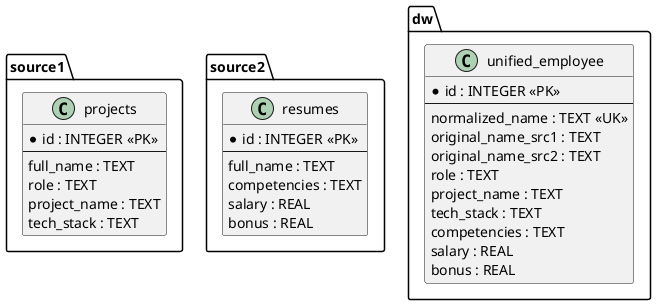

# Задание 2. ETL-процесс: сбор и объединение данных из разных БД

## Описание задания

Необходимо разработать программу, которая:

1. Создаёт 3 реляционные базы данных:
   - `source1.db` — источник данных о проектах (роль, проект, технологический стек).
   - `source2.db` — источник данных о компетенциях, зарплате и премиях.
   - `datawarehouse.db` — хранилище данных (ХД) с объединённой информацией.
2. Заполняет две БД-источника данными, в которых **ФИО записаны в 5 разных вариациях** (разный порядок слов, разный регистр).
3. Реализует алгоритм (описанный в BPMN) по сбору, нормализации и объединению данных в ХД.
4. Проектирует БД с ER-диаграммой и обоснованием выбора СУБД и типов данных.

---

## ER-диаграмма



---

## BPMN-алгоритм сбора и объединения данных

Алгоритм реализован в нотации BPMN 2.0 (создан в Camunda Modeler 7.24). Файл диаграммы: `ETL_Process_Assignment2.bpmn`, фото диаграммы: `ETL_Process_Assignment2.png`. 

# Ключевые шаги процесса:

1. Старт
2. Подключение к `source1.db` и `source2.db` (параллельно)
3. Извлечение всех записей из таблиц projects и resumes
4. Нормализация ФИО (приведение к нижнему регистру, сортировка слов)
5. Объединение данных по нормализованному ключу в словарь
6. Загрузка объединённых записей в таблицу `unified_employee ХД`
7. Завершение

---

## Программная реализация

Требования: Python 3.7+, стандартная библиотека (sqlite3, re, os)

# Что делает программа:

1. Создаёт три файла `.db` в текущей директории
2. Заполняет `source1.db` и `source2.db` тестовыми данными (5 вариаций ФИО)
3. Читает данные, нормализует ФИО, объединяет по ключу
4. Сохраняет результат в `datawarehouse.db`

# Пример вывода в консоль

```1. Создание баз данных...
2. Заполнение источников данными (5 вариаций ФИО)...
3. Запуск ETL (сбор и объединение)...
4. Результат объединения:

=== Хранилище данных (ХД) ===
ID: 1
Нормализованное ФИО: иванов иван иванович
Исходное из source1: Иванов Иван Иванович
Исходное из source2: иванов иван иванович
Роль: Team Lead, Проект: Платформа аналитики, Стек: Python, SQL, Airflow
Компетенции: Python, SQL, DWH, Зарплата: 120000.0, Премия: 15000.0
...
```

Можно открыть `datawarehouse.db` в любом SQLite-браузере (например, SQLiteStudio) и выполнить "SELECT * FROM unified_employee;"

---

## Архитектура и обоснование

Выбор СУБД: SQLite - не требует установки сервера, работает «из коробки» с Python; достаточно для объёмов < 100 000 записей; все данные в одном файле – легко копировать и версионировать; поддерживает `TEXT`, `INTEGER` и `REAL`, что покрывает все потребности задачи.

Выбор типов данных: 

1. `id` (`INTEGER`) - быстрое индексирование, автоинкремент
2. `full_name`, `role`, `project_name`, `tech_stack`, `competencies` (`TEXT`) - строки неограниченной длины, нет жёстких ограничений
3. `salary`, `bonus` (`REAL`) - денежные значения могут быть дробными
4. `normalized_name` (`TEXT UNIQUE`) - уникальный ключ для слияния данных из двух источников

Нормализация ФИО: алгоритм, который позволяет сопоставить записи из разных БД

```def normalize_name(name):
    cleaned = re.sub(r'[^\w\s]', '', name)
    words = cleaned.lower().split()
    words.sort()
    return " ".join(words)
```

# Пример работы:

1. Иванов Иван Иванович -> иванов иван иванович
2. петров петр петрович	-> петров петр петрович
3. СидорОВ СИДОР Сидорович -> сидор сидорович сидоров